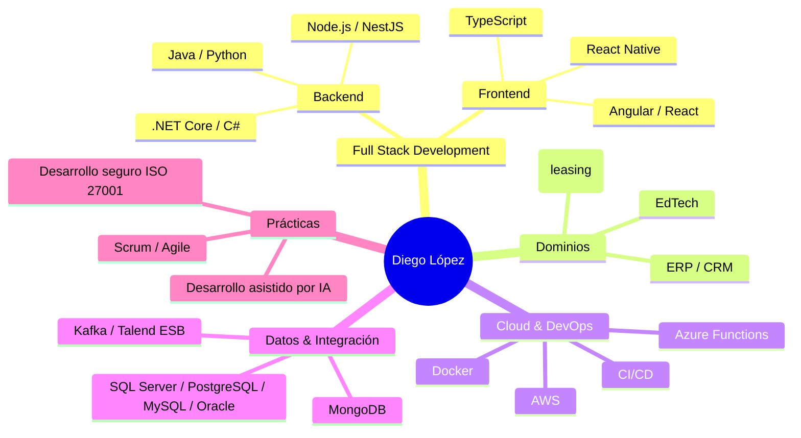

<div align="center">

# 👨‍💻 Diego Patricio López Lalangui

[](https://git.io/typing-svg)


</div>

---

## 🚀 Sobre Mí

```typescript
const diego = {
    role: "Senior Full Stack Developer",
    location: "Loja, Ecuador 🇪🇨",
    experience: "9+ years",
    currentWork: "LILAB - Lima Innovation Lab (Perú) · Remote",
    domain: ["Fintech (leasing)", "EdTech", "Marketplaces", "ERP / CRM"],
    education: "Ingeniero en Sistemas - Universidad Nacional de Loja",

    mindset: {
        passion: "Resolver problemas complejos con código limpio",
        philosophy: "El autoaprendizaje no es opcional, es esencial",
        focus: "Construir software que realmente importe"
    },

    speaking: ["🇪🇸 Español (Nativo)", "🇬🇧 English (B1)"],

    currentlyLearning: ["Desarrollo asistido por IA (Claude Code)", "Kubernetes", "Microservicios"],
    openTo: "Roles Senior Full Stack, remoto o en Ecuador, especialmente fintech"
};
```

---

## 💻 Tech Stack

### **Backend**


### **Frontend & Mobile**


### **Databases**


### **Cloud & DevOps**


### **Integración & Herramientas**


---

## 💼 Experiencia Destacada

### 🏦 **Desarrollador Full Stack** | LILAB - Lima Innovation Lab (Perú) · Remote
**Sep 2023 - Actualidad**

Plataforma de **leasing financiero** para el mercado chileno con **1000+ usuarios**.

- 🧩 **Líder del módulo de bienes** (activos en leasing): diseño, desarrollo y mantenimiento de punta a punta
- 🛡️ **Supervisor del módulo de seguros** asociados a los contratos
- 📄 Funcionalidades en los módulos de **contratos, operaciones y reportes**
- ⚙️ Stack: **React**, **TypeScript**, **Node.js**, **C#/.NET**, **SQL Server**, **MySQL**, **AWS**, CI/CD
- 🔐 Desarrollo seguro bajo **ISO 27001** en un entorno financiero regulado

### 🏢 **Desarrollador Full Stack** | LojaSoft Solutions (Loja, Ecuador)
**Sep 2018 - Ago 2023** | *5 años*

Empresa de servicios de software: producto propio y proyectos para clientes.

**🎓 Genus Académico** (producto propio) — plataforma de gestión académica para colegios, **300+ usuarios**
- 🔧 API: .NET Core 5 + Entity Framework + PostgreSQL + MongoDB
- 💬 Chat en tiempo real: NestJS + Express + WebSockets + MongoDB
- 📊 Admin: Angular 12 + Redux + Angular Material
- 📱 Prototipo móvil (Genus Meet): React Native + Redux

**🤝 Proyectos para clientes**
- **Sentinel – Confident** (2022–2023): Angular 11 + lógica en SQL Server
- **Grupo Business IT – Medianet** (2022–2023): Kafka + Quartz + .NET Core 6 + SQL Server
- **Campusoft – Marketplace** (2021–2022): integración con Microsoft Partner Center vía Azure Functions + .NET Core 5 + MongoDB
- **UTPL** (2018–2020): integraciones del ERP Banner (Java, Oracle, Talend ESB, ActiveMQ, SOAP) y personalizaciones de Dynamics 365 (CRM)

---

## 🎓 Certificaciones & Formación

<table>
<tr>
<td width="50%">

### 🎖️ **Certificaciones**
- 🤖 **Claude Code in Action** - Anthropic (2026) · [verificar](https://verify.skilljar.com/c/ru5kz2dwujr9)
- 🤖 **Introduction to Subagents** - Anthropic (2026)
- 🔐 **ISO 27001** - Hackmetrix (2024)
- 🔐 **Desarrollo Seguro** - Hackmetrix (2024)
- 🔐 **Concientización en Seguridad de la Información** - Hackmetrix (2024)
- ✅ **Scrum Foundation Professional (SFPC)** - CertiProf (2023)
- ✅ **Remote Work Professional (RWPC)** - CertiProf (2023)
- 🌐 **Introducción a la Ciberseguridad** y **NDG Linux Unhatched** - Cisco

</td>
<td width="50%">

### 🎯 **Formación & Soft Skills**
- 🎓 **Ingeniero en Sistemas Informáticos y Computación** - UNL (2017)
- 🎨 Principios UX/UI - LILAB
- 📐 Técnicas de Estimación - LILAB
- 🤝 Metodologías Ágiles (Scrum)
- 💬 Comunicación, feedback y negociación (Platzi)
- 🌐 Trabajo remoto en equipos internacionales

</td>
</tr>
</table>

---

## 🎯 Áreas de Especialización


```mermaid
mindmap
  root((Diego López))
    Full Stack Development
      Backend
        .NET Core / C#
        Node.js / NestJS
        Java / Python
      Frontend
        Angular / React
        TypeScript
        React Native
    Dominios
      Fintech (leasing)
      EdTech
      ERP / CRM
    Cloud & DevOps
      AWS
      Azure Functions
      Docker
      CI/CD
    Datos & Integración
      SQL Server / PostgreSQL / MySQL / Oracle
      MongoDB
      Kafka / Talend ESB
    Prácticas
      Scrum / Agile
      Desarrollo seguro ISO 27001
      Desarrollo asistido por IA
```

---

## 🌟 Filosofía de Trabajo

> *"El autoaprendizaje no es opcional en esta industria, es esencial. Cada proyecto es una oportunidad para aprender algo nuevo, y cada tecnología que domino es una herramienta más para resolver problemas de forma efectiva."*

### 🎯 Valores Profesionales:
- 💡 **Innovación continua** - Siempre explorando nuevas tecnologías
- 🤝 **Trabajo en equipo** - Colaboración sobre individualismo
- 📚 **Aprendizaje permanente** - Certificaciones y cursos constantes
- 🎨 **Código limpio** - Calidad sobre cantidad
- 🚀 **Impacto real** - Software que resuelva problemas reales

---

## 📫 Contacto & Redes

<div align="center">

[](mailto:diegopatrikll@gmail.com)
[](https://www.linkedin.com/in/diego-patricio-lopez-lalangui)
[](https://github.com/diplez)
[](https://wa.me/593968575936)

📍 **Loja, Ecuador** | 🌎 **Disponible para trabajo remoto**

</div>

---

<div align="center">

### 💭 Quote of the Day


---


**⭐ Si te gusta mi trabajo, no dudes en darle una estrella a mis repositorios ⭐**

</div>

---

<div align="center">
  
</div>
