<div align="center">

# 👨‍💻 Diego Patricio López Lalangui

[](https://git.io/typing-svg)

[](https://maps.app.goo.gl/loja)
[](https://github.com/diegopatrikll)
[](https://github.com/diegopatrikll)

</div>

---

## 🚀 Sobre Mí

```typescript
const diego = {
    role: "Full Stack Developer",
    location: "Loja, Ecuador 🇪🇨",
    experience: "8+ years",
    currentWork: "LILAB S.A.C. (Perú) - Remote",
    education: "Ingeniero en Sistemas - Universidad Nacional de Loja",

    mindset: {
        passion: "Resolver problemas complejos con código limpio",
        philosophy: "El autoaprendizaje no es opcional, es esencial",
        focus: "Construir software que realmente importe"
    },

    speaking: ["🇪🇸 Español (Nativo)", "🇬🇧 English (B1)"],

    currentlyLearning: ["IA Generativa", "Kubernetes", "Microservicios"],
    openTo: "Proyectos desafiantes con equipos colaborativos"
};
```

---

## 💻 Tech Stack

### **Frontend**


### **Backend**


### **Databases**


### **Cloud & DevOps**


### **Other Tools & Technologies**


---

## 📊 GitHub Stats

<div align="center">

[](https://git.io/streak-stats)


</div>

---

## 💼 Experiencia Destacada

### 🏢 **Desarrollador Full Stack** | LILAB S.A.C. (Perú) - Remote
**Sep 2023 - Actualidad** | *2+ años*

- ✨ Desarrollo de aplicaciones full stack con **React**, **Angular**, **.NET Core**, **Node.js**
- 🚀 Implementación de arquitecturas cloud en **AWS**
- 🔐 Desarrollo seguro aplicando estándares **ISO27001**
- 📱 Apps móviles con **React Native** (Android/iOS)

### 🎓 **Desarrollador Full Stack** | LojaSoft Solutions
**Sep 2018 - Ago 2023** | *5 años*

**Proyectos Principales:**
- **Genus Académico** - Plataforma educativa completa
  - 📊 Admin: Angular 12 + TypeScript + Redux + Material Design
  - 💬 Chat: Node.js + MongoDB + WebSockets v2 + NestJS
  - 📱 App Móvil (Genus Meet): React Native + Redux (iOS/Android)
  - 🔧 API: .NET Core 5 + PostgreSQL + Entity Framework

### 🏛️ **Desarrollador** | Universidad Técnica Particular de Loja
**Sep 2018 - Sep 2021** | *3 años*

- 🎯 Soporte técnico **Banner ERP** (Java, Python, Oracle)
- 💼 Soporte **CRM Dynamics 365** (Plugins, WebPages, JavaScript)
- 🔄 Integración con **Talend ESB**
- 🌐 Desarrollo de **SOAP** y **web services**

---

## 🎓 Certificaciones & Formación

<table>
<tr>
<td width="50%">

### 🎖️ **Certificaciones Profesionales**
- ✅ **Scrum Foundation Professional** - CertiProf
- ✅ **Remote Work Professional** - CertiProf
- ✅ **Cisco Networking** - Seguridad Cibernética
- ✅ **Linux Unhatched** - Cisco NDG
- ✅ **ISO27001** - Hackmetrix
- ✅ **Desarrollo Seguro** - LILAB
- ✅ **Principios UX/UI** - LILAB

</td>
<td width="50%">

### 🎯 **Tecnologías & Soft Skills**
- 🤝 Metodologías Ágiles (Scrum)
- 🔐 Seguridad de la Información
- 🎨 Diseño UX/UI
- 🤖 IA Generativa (LinkedIn Learning)
- 📐 Técnicas de Estimación
- 🌐 Trabajo Remoto Certificado

</td>
</tr>
</table>

---

## 🎯 Áreas de Especialización

```mermaid
mindmap
  root((Diego López))
    Full Stack Development
      Frontend
        React/Angular
        TypeScript
        Mobile (React Native)
      Backend
        .NET Core
        Node.js/NestJS
        Java/Python
    Cloud & DevOps
      AWS
      Azure
      Docker/Kubernetes
      CI/CD Pipelines
    Databases
      SQL (PostgreSQL, MySQL, Oracle)
      NoSQL (MongoDB, CouchDB)
    Soft Skills
      Scrum/Agile
      Remote Work
      Team Collaboration
      Continuous Learning
```



---

## 🌟 Filosofía de Trabajo

> *"El autoaprendizaje no es opcional en esta industria, es esencial. Cada proyecto es una oportunidad para aprender algo nuevo, y cada tecnología que domino es una herramienta más para resolver problemas de forma efectiva."*

### 🎯 Valores Profesionales:
- 💡 **Innovación continua** - Siempre explorando nuevas tecnologías
- 🤝 **Trabajo en equipo** - Colaboración sobre individualismo
- 📚 **Aprendizaje permanente** - Certificaciones y cursos constantes
- 🎨 **Código limpio** - Calidad sobre cantidad
- 🚀 **Impacto real** - Software que resuelva problemas reales

---

## 📫 Contacto & Redes

<div align="center">

[](mailto:diegopatrikll@gmail.com)
[](https://www.linkedin.com/in/diegopatrikll)
[](https://github.com/diegopatrikll)
[](https://wa.me/593968575936)

📍 **Loja, Ecuador** | 🌎 **Disponible para trabajo remoto**

</div>

---

## 📈 Actividad Reciente

<!--START_SECTION:activity-->
<!--END_SECTION:activity-->

---

<div align="center">

### 💭 Quote of the Day


---


**⭐ Si te gusta mi trabajo, no dudes en darle una estrella a mis repositorios ⭐**

</div>

---

<div align="center">
  
</div>
